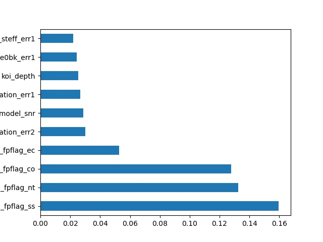

# Machine Learning - Exoplanet Exploration

## Background

Over a period of nine years in deep space, the NASA Kepler space telescope has been out on a planet-hunting mission to discover hidden planets outside of our solar system

## Objective

To utilize the given raw data to create machine learning models capable of classifying candidate exoplanets 

## Methods Used 

Models: 

	* Support Vector Machine
	* Random Forest
	* Deep Learning

## Process

	* Preprocess the dataset prior to fitting the model
	* Perform 'Feature Importance' and remove unnecessary features
	* Use `MinMaxScaler` to scale the numerical data
	* Use 'GridSearchCV' to turn model

## Selected Features 

## Results

After eliminated unnecessary features, the overall rate of accuracy has been improved. Each model is based on the top 10 important features for testing.  Below is the accuracy rate. 

	* Support Vector Machine Model: 85.4%
	* Random Forest Model: 90%
	* Deep Learning Model: 87.3%

	 

